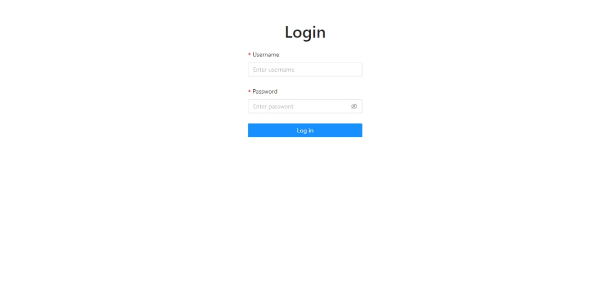
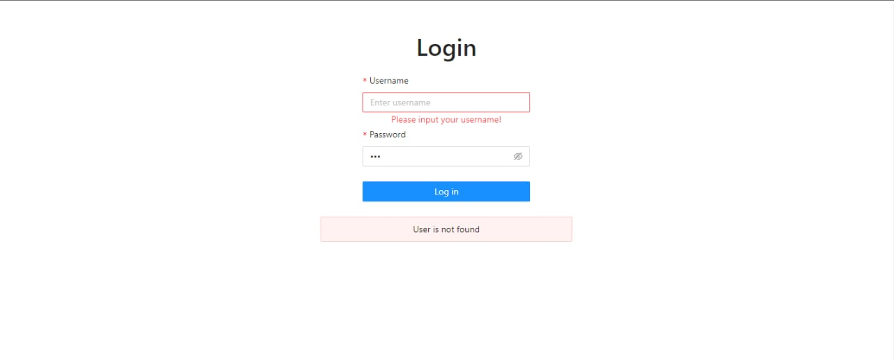
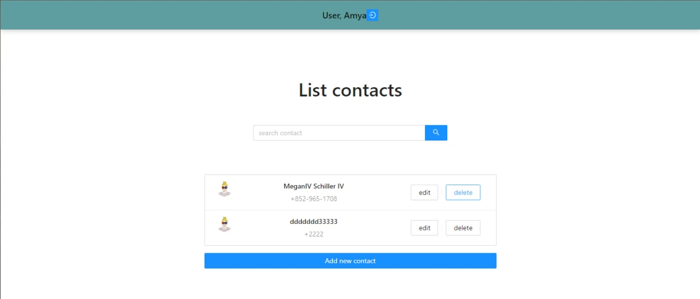

# Contact list with authorization

# 

## General info

Implement a small SPA application using React.js, which consists of 2 pages: "Login" and "Authorization".

## Main task

-   Logging into the account and handling errors in case the user did not find it or in case of errors during the request;
-   Refreshing the page after logging in keeps the user online;
-   Receiving, deleting, editing, adding, searching for contacts. Also error handling for each individual operation;
-   The title is only displayed if the user is logged in. It has a logout button.

### Error :

# 

### Contact Page :

# 

## Technologies

Project is created with:

-   React
-   TypeScript
-   Redux
-   Redux-Toolkit
-   React-Router

## Setup

Account:
Login: "Amya"
Password: ""

To run this project, install it locally using npm:

```
$ npm install
$ npm start
```

